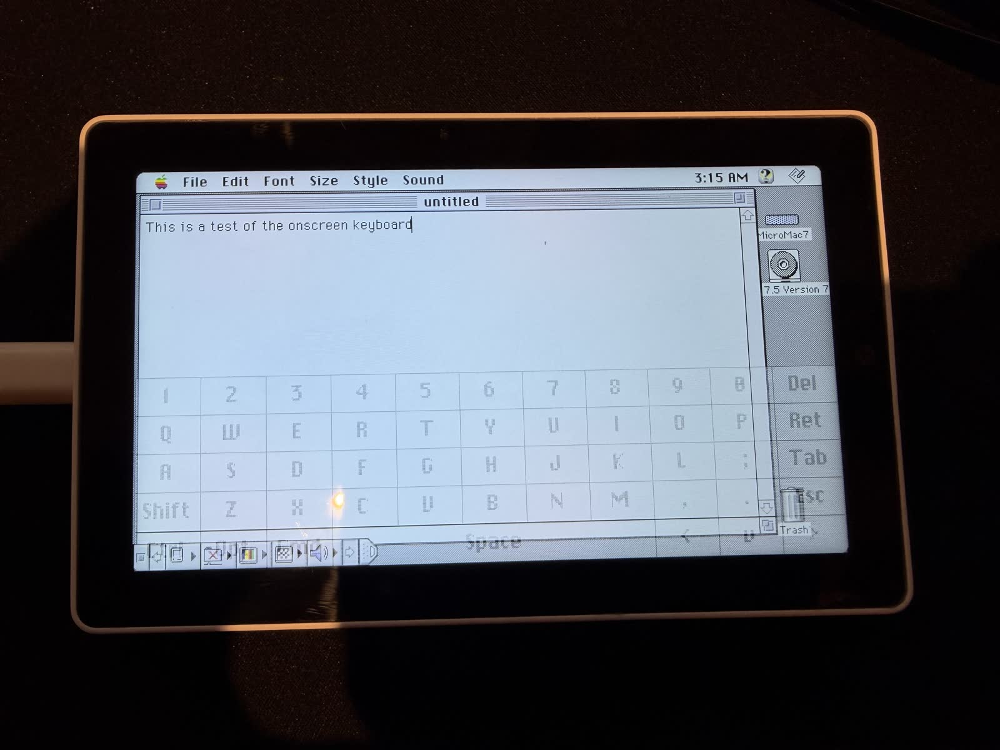
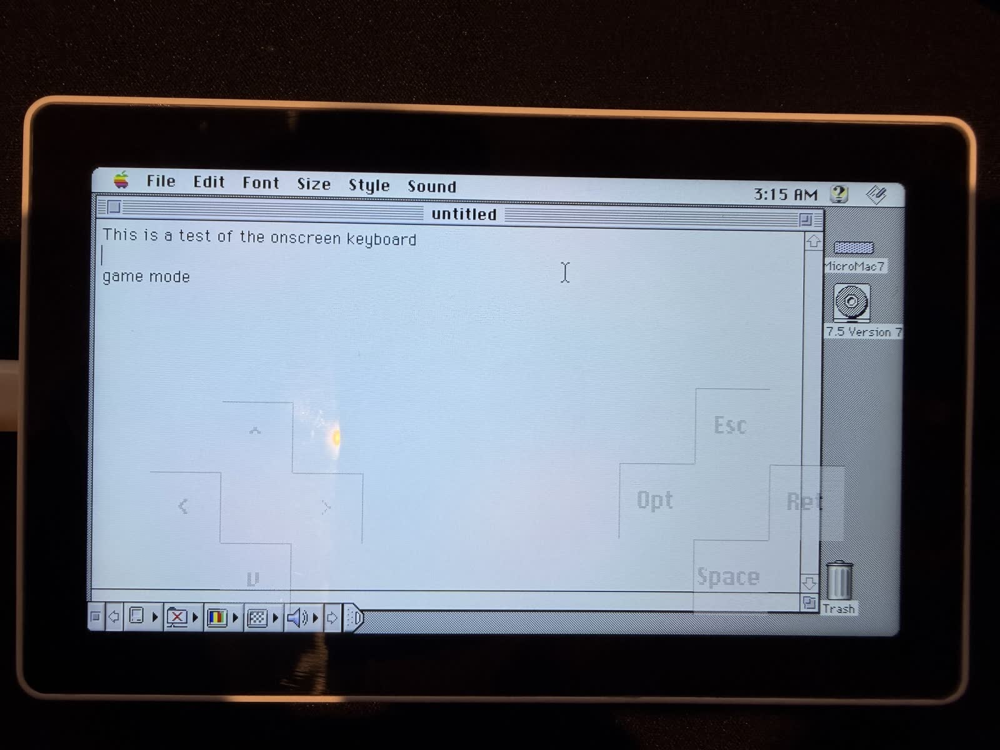
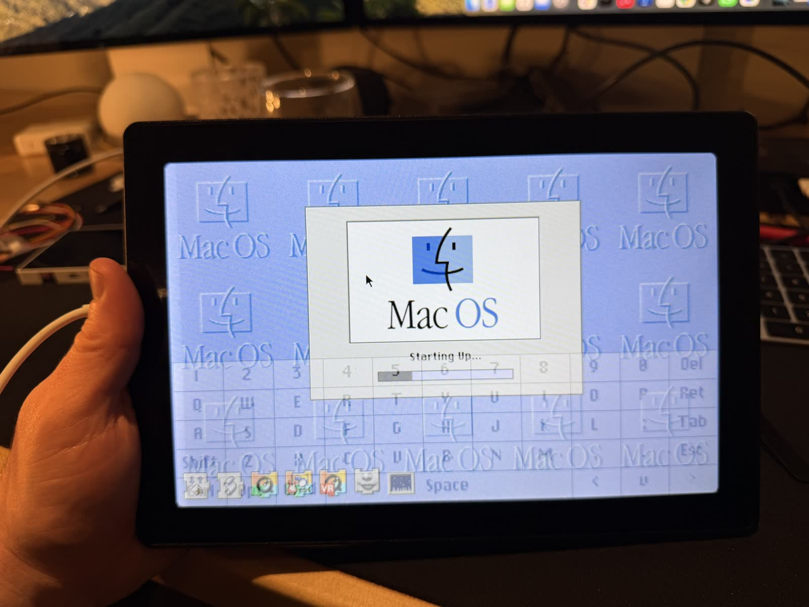
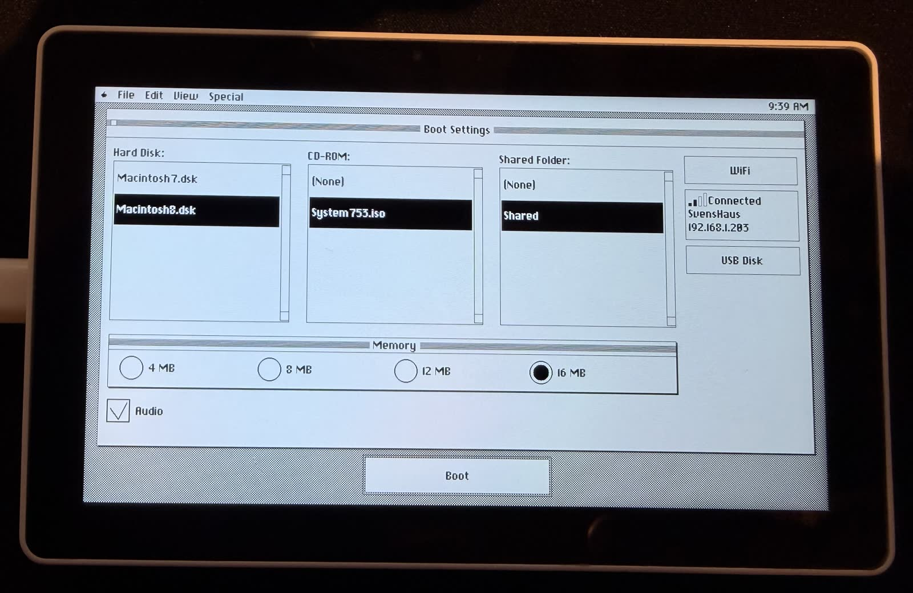

# BasiliskII ESP32 — Classic Macintosh Emulator

A full port of the **BasiliskII** Macintosh 68k emulator to the ESP32-P4, bringing classic Mac OS (System 7.x through Mac OS 8.1) to portable embedded devices with touchscreen and USB peripheral support.

Two boards are currently supported from the same source tree:

| Board                                                                                              | Display           | Mac screen | PlatformIO env        |
|----------------------------------------------------------------------------------------------------|-------------------|-----------:|-----------------------|
| [M5Stack Tab5](https://shop.m5stack.com/products/m5stack-tab5-iot-development-kit-esp32-p4)        | 5" 1280x720       | 640x360 @ 2x | `esp32p4_pioarduino` |
| [Waveshare ESP32-P4-WIFI6-Touch-LCD-10.1](https://www.waveshare.com/esp32-p4-wifi6-touch-lcd-7-8-10.1.htm) | 10.1" 800x1280 (rotated to 1280x800 landscape) | 640x400 @ 2x | `waveshare_p4_101`   |

Both variants share the BasiliskII core, video pipeline, USB HID handling, and boot GUI. Per-board drivers live behind a thin HAL in [`src/board/`](src/board/); see [`docs/waveshare/README.md`](docs/waveshare/README.md) for the Waveshare-specific pin map and notes.


---

## Screenshots

<p align="center">
  
</p>

*Flying Toasters running smoothly with write-time dirty tracking and tile-based rendering — the three-finger on-screen keyboard lives one gesture away*

<p align="center">
  
  
</p>

<p align="center">
  
  
</p>

<p align="center">
  
</p>

*Browsing the web on System 7 via the built-in WiFi networking*

<p align="center">
  <a href="screenshots.md">
    
  </a>
</p>

---

## What's New in v4.1 beta 2

- **Plug-and-play Tab5 Keyboard (beta)** — the official 70-key Tab5
  Keyboard on Ext.Port1 is detected automatically at startup and after
  hot-plugging; there is no setting to enable. Its native I2C event
  stream feeds the same Mac ADB path as USB and on-screen keyboards,
  including letters, numbers, symbols, Tab, Esc, Delete, Return, arrow
  keys, Shift/Aa, Control, and Alt/Option. If the module is absent, its
  GPIO0/GPIO1 bus stays out of the input hot path apart from a lightweight
  periodic probe.
- **All Tab5 display revisions (beta)** — Tab5 units built with the newer
  ST7121 display now boot alongside ST7123 and legacy ILI9881C revisions.
  M5GFX identifies the controller during `M5.begin()` and applies the
  matching DSI clock, timing, initialization table, and touch driver
  automatically; there is no board-revision build or user toggle.

- **Faster SD flush + shutdown sync** — the on-card disk image is
  now flushed every 2 seconds (down from 120 s) and again ~500 ms
  after the guest goes idle, so a power pull during normal use
  loses at most a couple of seconds of writes instead of two
  minutes. Programmatic resets (`esp_restart`, panics, watchdogs)
  also drain the buffer through an
  `esp_register_shutdown_handler` hook in [`src/main.cpp`](src/main.cpp).
  XPRAM saves opportunistically flush the disk too, since they
  are a strong "the user just changed something" signal.
- **HID report-descriptor parser** — modern USB mice that send
  non-standard X/Y bit layouts (most current Logitech / optical
  mice) used to hit a heuristic that mapped X bits onto Y, leaving
  the cursor moving mostly up and down. The new parser in
  [`src/basilisk/hid_descriptor.cpp`](src/basilisk/hid_descriptor.cpp)
  fetches `GET_DESCRIPTOR(REPORT)` for each HID interface and
  decodes Usage Page / X / Y / Wheel / Buttons generically. Vintage
  boot-mode mice (the original Apple roll-ball USB mouse, etc.)
  keep working through the existing fallback decoder. Scroll wheel
  forwards as Mac arrow keys so scroll-aware classic-Mac apps
  respond.
- **Boot from CD** — the boot GUI gained a "Boot from CD" checkbox
  next to the CD-ROM picker. When set with a CD selected,
  [`prefs_esp32.cpp`](src/basilisk/prefs_esp32.cpp) sets
  `bootdriver=-62` (CDROMRefNum) so the Mac boots from the ISO
  instead of the hard disk - same effect as holding **C** at boot
  on a real Mac. Used together with the new minimal TOC stubs in
  [`sys_esp32.cpp`](src/basilisk/sys_esp32.cpp), Mac OS install
  CDs that previously bailed during TOC probe now boot.
- **Wider CD / disk file pickers** — `.cdr` and `.toast` files now
  show up alongside `.iso` in the CD-ROM picker, and `.hfv`
  (Win Basilisk II / Mini vMac) joins `.dsk`/`.img` in the hard
  disk picker.
- **Screen-rotation toggle** — a "Rotate 180" checkbox in the boot
  GUI flips between v4.0's USB-C-on-the-left layout (default) and
  USB-C-on-the-right. Tab5 only; the Waveshare 10.1" panel
  orientation is fixed by the ribbon location and the toggle is a
  no-op there. Drives both the framebuffer flip and the touch
  coordinate transform via a new
  `BoardDisplay_SetFlip180()` HAL entry.
- **ExtFS auto-create + visible errors** — selecting a shared
  folder that doesn't exist on the SD card now `mkdir`s it
  automatically and logs the resolved path; previous silent
  failures (case mismatch, deleted folder, etc.) are surfaced on
  the serial console with the actual `errno`.
- **Robust audio codec reset on every boot** — the ES8388 (Tab5)
  and ES8311 (Waveshare) audio codecs keep their state through any
  ESP32 reset because they have their own power rail. A crash or
  panic mid-playback could leave the chip stuck enough that audio
  was silent until the user pulled power. v4.1 unconditionally
  performs a full mute + power-down + chip-reset sequence over I2C
  before the normal codec init runs on both boards, so a soft
  reboot now recovers audio the same as a power cycle. Logs the
  reset reason and a post-reset register read for diagnostics.
- **exFAT card detection** — the precompiled FatFs in pioarduino
  is built without exFAT support (FF_FS_EXFAT=0), so a card
  formatted as exFAT used to fail with a generic "init failed"
  message. v4.1's `BoardSD_ProbeFilesystem()` reads sector 0
  directly via the underlying SDSPI / SDMMC host driver after a
  failed mount and prints a specific "Card detected, formatted as
  exFAT — reformat as FAT32" message on the serial console so the
  fix is obvious. The sdkconfig overrides also flip
  `CONFIG_FATFS_USE_EXFAT=y` as future-proofing for whenever the
  upstream framework enables it.

You can edit `/basilisk_settings.txt` on the SD card directly to
flip any of these without going through the GUI:
`ramsize=16`, `boot_from_cd=yes`, `rotation=0`, `audio=no`, etc.
Allowed RAM values are 4 / 8 / 12 / 16 MB; allowed rotations are
`0` and `180`. The traditional desktop-Basilisk
`~/.basilisk_ii_prefs` file format is *not* read by this port -
all preferences live in `/basilisk_settings.txt`.

A note on ROMs: any `.ROM` whose 16-bit version word at offset
8 reads `0x067C` (32-bit clean Mac II family — Q650, Q800, Q900,
Q950) or `0x0276` (Classic) will boot. The default file path is
`/Q650.ROM` but the filename itself is arbitrary. Set
`rom=/MyROM.ROM` in the settings file to override.

### SD card formats

- **FAT32** is the only fully supported format. Cards up to ~2 TB
  partition size are fine.
- **exFAT** is *not* mountable: the precompiled FatFs that ships
  with pioarduino is built with `FF_FS_EXFAT=0`, so f_mount returns
  `FR_NO_FILESYSTEM` on exFAT cards. v4.1 detects this case and
  prints a clear message on the serial console — "Card detected,
  formatted as exFAT. Please reformat as FAT32." — instead of the
  generic "init failed". sdkconfig already declares
  `CONFIG_FATFS_USE_EXFAT=y` so if upstream pioarduino flips that on
  in a future release, this firmware will pick up exFAT support
  with no source change.
- **FAT32 single-file 4 GB cap** is rarely a problem in practice.
  Mac OS HFS volumes top out at 2 GB, so even maxed-out `.dsk`
  images fit. ISO images larger than 4 GB (mostly Mac OS X DVD
  installers, which this firmware can't run anyway) are the one
  realistic case where you'd want exFAT.
- **Disk-image extensions** in the boot GUI picker: `.dsk`, `.img`,
  `.hfv`. `.hfv` is the Win Basilisk II / Mini vMac default and is
  treated as a raw HFS image just like `.dsk`.
- **CD-ROM extensions**: `.iso`, `.cdr`, `.toast`.

---

## What's New in v4.0

- **Multi-touch on-screen keyboard** — three-finger tap anywhere on the
  Mac screen spawns a full QWERTY overlay with sticky Shift / Ctrl /
  Option / Command modifiers and an arrow cluster. Typing drives real
  ADB keystrokes, so it works in any Mac application — Finder, SimpleText,
  HyperCard, Netscape, the works. Three-finger tap again to dismiss.
- **Gaming overlay** — four-finger tap spawns a D-pad plus
  Esc / Return / Space / Option action cluster for arrow-key games
  (Glider, Crystal Quest, Marathon, etc.). Four-finger tap dismisses;
  a three-finger tap while the gaming overlay is up swaps straight
  over to the keyboard.
- **"Transparent" overlay without alpha math** — because every Mac
  pixel is already pixel-doubled to a 2x2 physical block, the compositor
  writes only the `(even, even)` sub-pixel of each block, giving exact
  25% coverage so the Mac content shows through the other three
  sub-pixels for free. Held keys overlay a 50% checker of black for a
  pressed look; latched modifiers use the opposite checker so you can
  tell at a glance which Shift state is active.
- **Per-board PlatformIO pinning** — the Tab5 and Waveshare now lock
  to different pioarduino releases because each adjacent release breaks
  the other board. Tab5 stays on `55.03.35` (IDF 5.5.1) to avoid a
  MIPI-DSI backlight flicker that hit M5GFX in IDF 5.5.2; Waveshare
  moves to `55.03.38-1` (IDF 5.5.4) to pick up the newer `esp_hosted`
  that no longer panics in `sdio_rx_get_buffer` under sustained SD I/O.
- **Tab5 USB Disk over USB-A** — SD-card-over-USB-MSC now routes through
  the Tab5's USB-A port (OTG-HS, where TinyUSB actually lands on the
  ESP32-P4) instead of USB-C. HWCDC stays alive throughout, so the
  serial console keeps working while the card is mounted on your host.
  Plug a standard USB-A-to-USB-C cable into the Tab5 USB-A jack and
  the other end into your computer; Tab5's own 5V output is gated off
  so the host supplies VBUS.
- **Auto-sized USB Disk dialog** — the pre-boot MSC dialog now grows
  to fit its copy so the Tab5 cable instructions no longer run under
  the Done button.
- **Carry-forward from the 3.4.x line** — 180° Tab5 rotation,
  single-refresh boot splash, shared folder (ExtFS), baked-in ESP32-C6
  WiFi firmware with SDIO hosted OTA, XPRAM write coalescing, and the
  pre-boot-to-Mac-OS handoff with no gray flash.

<p align="center">
  
  
</p>

<p align="center">
  
  
</p>

---

## Overview

This project runs a **Motorola 68040** emulator that can boot real Macintosh ROMs and run genuine classic Mac OS software. Performance is comparable to a **Macintosh Quadra 610** (25 MHz 68040), achieving **24 FPS video** and **2-3 MIPS** CPU speed. The emulation includes:

- **CPU**: Motorola 68040 emulation with FPU (68881) — 2-3 MIPS
- **RAM**: Configurable from 4MB to 16MB (allocated from ESP32-P4's 32MB PSRAM)
- **Display**: 640×360 virtual display (2× scaled to 1280×720 physical display), supporting 1/2/4/8-bit color depths at 24 FPS
- **Storage**: Hard disk and CD-ROM images loaded from SD card
- **Input**: Capacitive touchscreen, USB keyboard/mouse, and auto-detected official Tab5 Keyboard
- **Audio**: Classic Mac sound output via ES8388 codec (toggleable in boot GUI)
- **Networking**: WiFi internet access via NAT router (TCP, UDP, ICMP, DHCP)
- **Video**: Optimized pipeline with write-time dirty tracking, double-buffered DMA, and tile-based rendering

## Hardware

### [M5Stack Tab5](https://shop.m5stack.com/products/m5stack-tab5-iot-development-kit-esp32-p4)

The Tab5 features a unique **dual-chip architecture** that makes it ideal for this project:

| Chip | Role | Key Features |
|------|------|--------------|
| **ESP32-P4** | Main Application Processor | 400MHz dual-core RISC-V, 32MB PSRAM, MIPI-DSI display |
| **ESP32-C6** | Wireless Co-processor | WiFi 6, Bluetooth LE 5.0 — provides internet access to classic Mac OS |

### Key Specifications

| Component | Details |
|-----------|---------|
| **Display** | 5" IPS TFT, 1280×720 (720p), MIPI-DSI; ILI9881C, ST7123, and ST7121 revisions auto-detected |
| **Touch** | Capacitive multi-touch (GT911 or integrated ST712x, auto-detected) |
| **Memory** | 32MB PSRAM for emulated Mac RAM + frame buffers |
| **Storage** | microSD card slot for ROM, disk images, and settings |
| **USB** | Type-A host port for keyboard/mouse, Type-C for programming |
| **Audio** | ES8388 DAC/ADC codec — classic Mac sound output |
| **Battery** | NP-F550 Li-ion (2000mAh) for portable operation |

See [boardConfig.md](boardConfig.md) for detailed pin mappings and hardware documentation.

---

## Architecture

### Dual-Core Design

The emulator leverages the ESP32-P4's dual-core RISC-V architecture for optimal performance:

```
┌─────────────────────────────────────────────────────────────────┐
│                        ESP32-P4 (400MHz)                        │
├────────────────────────────┬────────────────────────────────────┤
│         CORE 0             │              CORE 1                │
│    (Video & I/O Core)      │       (CPU Emulation Core)         │
├────────────────────────────┼────────────────────────────────────┤
│  • Video rendering task    │  • 68040 CPU interpreter           │
│  • Double-buffered DMA     │  • Fast-path memory access         │
│  • 2×2 pixel scaling       │  • Write-time dirty marking        │
│  • Input task (60Hz)       │  • Batch instruction execution     │
│  • USB HID processing      │  • ROM patching                    │
│  • Audio output (ES8388)   │  • Disk I/O                        │
│  • Network RX polling      │                                    │
│  • Event-driven @ 24 FPS   │                                    │
└────────────────────────────┴────────────────────────────────────┘
```

### Memory Layout

```
┌──────────────────────────────────────────────────────────────┐
│                    32MB PSRAM Allocation                     │
├──────────────────────────────────────────────────────────────┤
│  Mac RAM (4-16MB)          │  Configurable via Boot GUI      │
├────────────────────────────┼─────────────────────────────────┤
│  Mac ROM (~1MB)            │  Q650.ROM or compatible         │
├────────────────────────────┼─────────────────────────────────┤
│  Mac Frame Buffer (230KB)  │  640×360 @ 8-bit indexed color  │
├────────────────────────────┼─────────────────────────────────┤
│  Display Buffer (1.8MB)    │  1280×720 @ RGB565              │
├────────────────────────────┼─────────────────────────────────┤
│  Free PSRAM                │  Varies based on RAM selection  │
└──────────────────────────────────────────────────────────────┘

┌──────────────────────────────────────────────────────────────┐
│                    Internal SRAM (Priority)                  │
├──────────────────────────────────────────────────────────────┤
│  CPU Function Table        │  cpufunctbl - hot path lookup   │
├────────────────────────────┼─────────────────────────────────┤
│  Memory Bank Pointers      │  256KB - memory banking         │
├────────────────────────────┼─────────────────────────────────┤
│  Palette (512 bytes)       │  256 RGB565 entries             │
├────────────────────────────┼─────────────────────────────────┤
│  Dirty Tile Bitmap         │  144 bits (write-time tracking) │
├────────────────────────────┼─────────────────────────────────┤
│  Tile Render Lock Bitmap   │  144 bits (race prevention)     │
├────────────────────────────┼─────────────────────────────────┤
│  Double-Buffered Tile Bufs │  ~28KB (DMA pipelining)         │
└──────────────────────────────────────────────────────────────┘
```

### Video Pipeline

The video system uses a highly optimized pipeline with **write-time dirty tracking** to minimize CPU overhead:

```
┌─────────────────────────────────────────────────────────────────┐
│                    Video Pipeline Architecture                   │
├─────────────────────────────────────────────────────────────────┤
│                                                                  │
│  ┌──────────────┐    marks dirty    ┌─────────────────────────┐ │
│  │  68040 CPU   │ ─────────────────▶│   Dirty Tile Bitmap     │ │
│  │  (Core 1)    │                   │   (16×9 = 144 tiles)    │ │
│  └──────────────┘                   └─────────────────────────┘ │
│         │                                      │                │
│         │ writes                               │ read & clear   │
│         ▼                                      ▼                │
│  ┌──────────────┐                   ┌─────────────────────────┐ │
│  │ Mac Frame    │                   │    Video Task (Core 0)  │ │
│  │   Buffer     │ ─────────────────▶│  • Tile snapshot        │ │
│  │ (640×360)    │   read tiles      │  • Palette lookup       │ │
│  └──────────────┘                   │  • 2×2 scaling          │ │
│                                     └─────────────────────────┘ │
│                                                │                │
│                                                │ push tiles     │
│                                                ▼                │
│                                     ┌─────────────────────────┐ │
│                                     │   MIPI-DSI Display      │ │
│                                     │      (1280×720)         │ │
│                                     └─────────────────────────┘ │
└─────────────────────────────────────────────────────────────────┘
```

#### Key Features

1. **Write-Time Dirty Tracking**: When the 68040 CPU writes to the framebuffer, the memory system immediately marks the affected tile(s) as dirty. This eliminates expensive per-frame comparisons.

2. **Tile-Based Rendering**: The screen is divided into a 16×9 grid of 40×40 pixel tiles (144 total). Only dirty tiles are re-rendered each frame, typically reducing video CPU time by 60-90%.

3. **Double-Buffered DMA**: Render to one buffer while DMA pushes another to the display. Both tile rendering and full-frame streaming use this pipelining for maximum throughput.

4. **Per-Tile Render Locks**: Atomic locks prevent race conditions during tile snapshot. If the CPU writes to a tile being rendered, it's automatically re-queued for the next frame—ensuring glitch-free display.

5. **Multi-Depth Support**: Supports 1/2/4/8-bit indexed color modes with packed pixel decoding. Mac OS can switch between depths via the Monitors control panel.

6. **Event-Driven Refresh at 24 FPS**: Cinema-standard frame rate with task notifications—the video task sleeps until signaled, reducing idle polling overhead.

---

## Emulation Details

### BasiliskII Components

This port includes the following BasiliskII subsystems, adapted for ESP32:

| Component | File(s) | Description |
|-----------|---------|-------------|
| **UAE CPU** | `uae_cpu/*.cpp` | Motorola 68040 interpreter |
| **Memory** | `uae_cpu/memory.cpp` | Memory banking with write-time dirty tracking |
| **ADB** | `adb.cpp` | Apple Desktop Bus for keyboard/mouse |
| **Video** | `video_esp32.cpp` | Tile-based display driver with 2× scaling |
| **Disk** | `disk.cpp`, `sys_esp32.cpp` | HDD image support via SD card |
| **CD-ROM** | `cdrom.cpp` | ISO image mounting |
| **XPRAM** | `xpram_esp32.cpp` | Non-volatile parameter RAM |
| **Timer** | `timer_esp32.cpp` | 60Hz/1Hz tick generation |
| **ROM Patches** | `rom_patches.cpp` | Compatibility patches for ROMs |
| **Audio** | `audio_esp32.cpp` | Sound output via ES8388 codec |
| **Networking** | `ether_esp32.cpp`, `net_router.cpp` | WiFi NAT router (TCP/UDP/ICMP/DHCP) |
| **Input** | `input_esp32.cpp` | Touch + USB HID handling |

### Supported ROMs

The emulator works best with **Macintosh Quadra** series ROMs:

| ROM File | Machine | Recommended |
|----------|---------|-------------|
| `Q650.ROM` | Quadra 650 | ✅ Best compatibility |
| `Q700.ROM` | Quadra 700 | ✅ Good |
| `Q800.ROM` | Quadra 800 | ✅ Good |
| `68030-IIci.ROM` | Mac IIci | ⚠️ May work |

### Supported Operating Systems

| OS Version | Status | Notes |
|------------|--------|-------|
| System 7.1 | ✅ Works | Lightweight, fast boot |
| System 7.5.x | ✅ Works | Good compatibility |
| Mac OS 8.0 | ✅ Works | Full-featured |
| Mac OS 8.1 | ✅ Works | Latest supported |

---

## Getting Started

### Prerequisites

- **Hardware**: M5Stack Tab5
- **Software**: [PlatformIO](https://platformio.org/) (CLI or IDE extension)
- **SD Card**: FAT32 formatted microSD card (8GB+ recommended)

### SD Card Setup

#### Quick Start (Recommended)

Download a ready-to-use SD card image with Mac OS pre-installed:

**[📥 Download sdCard.zip](https://www.mcchord.net/static/sdCard.zip)**

1. Format your microSD card as **FAT32**
2. Extract the ZIP contents to the **root** of the SD card
3. Insert into Tab5 and boot

#### Manual Setup

Alternatively, create your own setup with these files in the SD card root:

```
/
├── Q650.ROM              # Macintosh Quadra ROM (required)
├── Macintosh.dsk         # Hard disk image (required)
├── System753.iso         # Mac OS installer CD (optional)
└── DiskTools1.img        # Boot floppy for installation (optional)
```

To create a blank disk image:

```bash
# Create a 500MB blank disk image
dd if=/dev/zero of=Macintosh.dsk bs=1M count=500
```

Then format it during Mac OS installation.

### Flashing the Firmware

Pick the environment that matches your hardware:

- M5Stack Tab5 -> `esp32p4_pioarduino`
- Waveshare P4 10.1" -> `waveshare_p4_101`

The resulting merged binary lands in `release/M5Tab-Macintosh.bin` regardless of env.

```bash
pio run -e esp32p4_pioarduino     # Tab5
pio run -e waveshare_p4_101       # Waveshare
```

See [`docs/waveshare/README.md`](docs/waveshare/README.md) for the Waveshare pin map and BSP notes.

#### Option 1: Pre-built Firmware (Easiest)

Download the latest release from GitHub:

**[📥 Download Latest Release](https://github.com/amcchord/M5Tab-Macintosh/releases/latest)**

Flash the single merged binary using `esptool.py`:

```bash
# Install esptool if you don't have it
pip install esptool

# Flash the merged binary (connect Tab5 via USB-C)
esptool.py --chip esp32p4 \
    --port /dev/ttyACM0 \
    --baud 921600 \
    write_flash \
    0x0 M5Tab-Macintosh-v4.0.bin
```

**Note**: Replace `/dev/ttyACM0` with your actual port:
- **macOS**: `/dev/cu.usbmodem*` or `/dev/tty.usbmodem*`  
  (Run `ls /dev/cu.*` to find available ports)
- **Windows**: `COM3` (or similar, check Device Manager)
- **Linux**: `/dev/ttyACM0` or `/dev/ttyUSB0`

**Troubleshooting Flash Issues**:
- If flashing fails, try a lower baud rate: `--baud 460800` or `--baud 115200`
- If the device isn't detected, hold the **BOOT** button while pressing **RESET** to enter bootloader mode
- On some systems you may need to run with `sudo` or add your user to the `dialout` group

#### Option 2: Build from Source

```bash
# Clone the repository
git clone https://github.com/amcchord/M5Tab-Macintosh.git
cd M5Tab-Macintosh

# Build the firmware
pio run

# Upload to device (connect via USB-C)
pio run --target upload

# Monitor serial output
pio device monitor
```

#### Creating Release Binaries

When you build with `pio run`, a merged binary is automatically created in the `release/` directory. This binary includes the bootloader, partition table, and application - ready for single-command flashing.

For versioned releases, use the release script:

```bash
# Create versioned release binaries for both boards
./scripts/build_release.sh v4.0

# Output:
#   release/M5Tab-Macintosh-v4.0.bin
#   release/M5Tab-Macintosh-Waveshare-P4-10.1-v4.0.bin
```

The release binary can be flashed with a single esptool command:

```bash
esptool --chip esp32p4 --port /dev/cu.usbmodem* \
    --baud 921600 write-flash 0x0 release/M5Tab-Macintosh-v4.0.bin
```

---

## Pre-Boot Environment

On every startup, a **classic Mac-style pre-boot configuration screen**
appears before the 68k actually starts. This is where you pick the
disk, CD, RAM size, WiFi, shared folder, and (on Tab5) USB Disk mode.

<p align="center">
  
</p>

### How to enter the pre-boot environment

1. Power on (or reset) the device. The Happy Mac splash shows while a
   3-second countdown ticks down at the bottom of the screen.
2. **Tap "Change Settings"** during that countdown. The countdown
   halts and you're dropped into the pre-boot settings screen. Stay
   there as long as you want — nothing auto-boots out from under you.
3. To get back here later, just power-cycle or hit reset. There is no
   in-emulator way back; the 68k has to stop first.

If you don't tap anything, the emulator boots with the last saved
settings after 3 seconds (or after WiFi finishes connecting, whichever
is later — WiFi connect can extend the pause up to ~10 s).

### What you can change

| Setting | Options | Default |
|---------|---------|---------|
| Hard Disk | Any `.dsk` or `.img` file on SD root | First found |
| CD-ROM | Any `.iso` file on SD root, or None | None |
| RAM Size | 4 MB, 8 MB, 12 MB, 16 MB | 8 MB |
| Audio | Enable / disable sound output | Enabled |
| WiFi | SSID + password via on-screen keyboard | None |
| Shared Folder | Any folder on the SD card — appears as a mounted volume in Mac OS | None |
| USB Disk (Tab5 only) | Expose the SD card over USB Mass Storage via USB-A | Off |

Settings are persisted to `/basilisk_settings.txt` on the SD card, so
the next boot starts with the same layout. The settings UI itself
lives in [`src/basilisk/boot_gui.cpp`](src/basilisk/boot_gui.cpp).

### WiFi Setup

To configure WiFi before booting:

1. Tap **"Change Settings"** during the countdown
2. Tap the **"WiFi"** button at the bottom of the settings screen
3. The device will scan for available networks
4. **Select a network** from the list
5. **Tap the password field** to open the on-screen keyboard
6. Enter your WiFi password and tap **"OK"**
7. Tap **"Connect"** to connect to the network
8. Once connected, tap **"Back"** to return to settings
9. Tap **"Boot"** to start the emulator

**Auto-Connect**: Once WiFi is configured, it will automatically connect on subsequent boots. The countdown screen will display:
- "WiFi: Connecting..." while connecting
- "WiFi: 192.168.x.x" once connected (shows your IP address)
- "WiFi: Connection failed" if the connection fails

The countdown will **pause while WiFi is connecting** (up to 10 seconds), ensuring the connection completes before booting into Mac OS.

### Networking Support

The emulator includes TCP/IP networking via the ESP32-C6 WiFi co-processor. This provides NAT-based internet access for classic Mac applications with built-in DHCP server support.

**Virtual Network Configuration:**
- MacOS IP: `10.0.2.15` (assigned via DHCP)
- Gateway: `10.0.2.2`
- DNS: `10.0.2.3` (forwarded to real DNS)

**Supported Protocols:**
- DHCP (automatic IP configuration)
- TCP (web browsing, FTP, etc.)
- UDP (DNS, NTP, etc.)
- ICMP (ping)

**WiFi Setup:**
1. During the boot countdown, tap **"Change Settings"**
2. Tap the **"WiFi"** button to open the WiFi configuration screen
3. Select your network and enter the password using the on-screen keyboard
4. Tap **"Connect"** - once connected, your IP will be displayed
5. The connection is saved and will auto-connect on future boots

**Mac OS Network Setup:**
1. In MacOS 8.x, open **TCP/IP Control Panel** and set:
   - Connect via: **Ethernet**
   - Configure: **Using DHCP Server**
   
   That's it! DHCP will automatically configure all network settings.

**Manual Configuration (if needed):**
- IP Address: `10.0.2.15`
- Subnet Mask: `255.255.255.0`
- Router/Gateway: `10.0.2.2`
- Name Server: `10.0.2.3`

**Compatible Applications:**
- MacTCP-based applications (Fetch, NCSA Telnet, etc.)
- Open Transport applications (Netscape Navigator, Internet Explorer)
- Ping utilities

---

## Input Support

### Touch Screen

The capacitive touchscreen acts as a single-button mouse:

- **Tap** = Click
- **Drag** = Click and drag
- Coordinates are scaled from 1280×720 display to 640×360 Mac screen

### On-Screen Keyboard & Gaming Overlay (v4.0)

The capacitive touchscreen can spawn a full **on-screen keyboard** or a
**gaming D-pad overlay** without plugging in anything. Toggle them with
multi-finger tap gestures anywhere on the Mac screen — the Mac mouse
still works for single-finger touches that land outside the overlay.

| Gesture | Action |
|---------|--------|
| **Three-finger tap** | Show / hide the QWERTY keyboard overlay |
| **Four-finger tap** | Show / hide the gaming D-pad overlay |
| Same gesture while an overlay is up | Hides that overlay |
| Opposite gesture while an overlay is up | Switches to the other overlay |

**Keyboard overlay** — full QWERTY with sticky Shift, Ctrl, Option,
and Command modifiers (tap once to latch, tap again to unlatch), plus
an arrow cluster. Keystrokes inject real ADB events so Cmd-S, Cmd-Q,
Cmd-Shift-3, etc. all work.

<p align="center">
  
  
</p>

**Gaming overlay** — on-screen D-pad mapped to the Mac arrow keys, plus
Esc / Return / Space / Option action buttons for classic Mac games that
expect keyboard input (Glider PRO, Crystal Quest, Marathon, etc.).

<p align="center">
  
</p>

The overlay renders as a 25% sub-pixel stipple so you can still see the
Mac content behind it. Held keys overlay a 50% black checker for a
pressed look; latched modifiers use the opposite checker to read
distinctly from momentary presses. The full implementation lives in
[`src/basilisk/touch_overlay.cpp`](src/basilisk/touch_overlay.cpp).

### USB Keyboard

Connect a USB keyboard to the **USB Type-A port**. Supported features:

- Full QWERTY layout with proper Mac key mapping
- Modifier keys: Command (⌘), Option (⌥), Control, Shift
- Function keys F1-F15
- Arrow keys and navigation cluster
- Numeric keypad
- **Caps Lock LED** sync with Mac OS

### Official Tab5 Keyboard (beta)

Attach the M5Stack 70-key Tab5 Keyboard to **Ext.Port1**. The firmware
probes its default I2C address (`0x6D`) on GPIO0/GPIO1, switches it to its
lossless matrix-event mode, and starts forwarding keys automatically. No
boot-GUI option or settings-file entry is required, and attaching or
removing the keyboard while the emulator is running is supported.

The physical keyboard works at the same time as USB HID and the
touchscreen overlays. Its **Aa** key maps to Mac Shift, **Ctrl** to Control,
**Alt** to Option, and **Sym** selects the printed symbol layer.

### USB Mouse

Connect a USB mouse for relative movement input:

- Left, right, and middle button support
- Relative movement mode (vs. absolute for touch)

---

## Project Structure

```
M5Tab-Macintosh/
├── src/
│   ├── main.cpp                    # Application entry point
│   └── basilisk/                   # BasiliskII emulator core
│       ├── main_esp32.cpp          # Emulator initialization & main loop
│       ├── video_esp32.cpp         # Tile-based display driver with dirty tracking
│       ├── input_esp32.cpp         # Touch + USB HID input handling
│       ├── boot_gui.cpp            # Pre-boot configuration GUI
│       ├── sys_esp32.cpp           # SD card disk I/O
│       ├── timer_esp32.cpp         # 60Hz/1Hz interrupt generation
│       ├── audio_esp32.cpp          # Sound output via ES8388 codec
│       ├── ether_esp32.cpp         # Network driver for WiFi NAT
│       ├── net_router.cpp          # TCP/UDP/ICMP NAT router
│       ├── xpram_esp32.cpp         # NVRAM persistence to SD
│       ├── prefs_esp32.cpp         # Preferences loading
│       ├── uae_cpu/                # Motorola 68040 CPU emulator
│       │   ├── newcpu.cpp          # Main CPU interpreter loop
│       │   ├── memory.cpp          # Memory banking with write-time dirty tracking
│       │   ├── fpu/                # FPU emulation (IEEE)
│       │   └── generated/          # CPU instruction tables
│       └── include/                # Header files
├── platformio.ini                  # PlatformIO build configuration
├── partitions.csv                  # ESP32 flash partition table
├── boardConfig.md                  # Hardware documentation
├── screenshots/                    # Demo images and videos
└── scripts/                        # Build helper scripts
```

---

## Performance

The emulator achieves **smooth desktop performance**, comparable to a real **Macintosh Quadra 610** (25 MHz 68040). Extensive optimization work on CPU scheduling, video rendering, disk I/O, and memory placement delivers a responsive experience across Mac OS 7 and 8.

### Benchmarks

| Metric | Value |
|--------|-------|
| **CPU Speed** | 2 - 3 MIPS (depending on workload) |
| **Video Refresh** | 24 FPS (cinema-standard smooth) |
| **Boot Time** | ~15 seconds to Mac OS desktop |
| **Comparison** | Similar to Macintosh Quadra 610 (25 MHz 68040) |
| Typical Dirty Tiles | 5-15 tiles/frame (vs. 144 total) |
| Video CPU Savings | 60-90% reduction with dirty tracking |

### Optimization Techniques

1. **Write-Time Dirty Tracking**: Marks tiles dirty at CPU write time, avoiding expensive per-frame comparisons. Dirty bitmap uses atomic operations for thread safety.

2. **Dual-Core Separation**: CPU emulation (Core 1) runs independently from video/input (Core 0) with minimal synchronization.

3. **Fast-Path Memory Access**: Inline checks for RAM/ROM bypass expensive memory bank lookup for the majority of memory operations.

4. **Batch Instruction Execution**: CPU executes 32 instructions per loop iteration before checking ticks, reducing per-instruction overhead.

5. **Double-Buffered DMA**: Video rendering uses double-buffered tiles and row buffers—render to one buffer while DMA pushes the other to display.

6. **Per-Tile Render Locks**: Atomic locks prevent race conditions during tile snapshot, ensuring glitch-free rendering even with concurrent CPU writes.

7. **Input Task on Core 0**: USB host processing (~2.3ms) runs in a dedicated task, offloading work from the CPU emulation loop.

8. **Memory Bank Placement**: The 256KB memory bank pointer array and CPU function table are allocated in internal SRAM for faster access.

9. **Adaptive CPU/IO Scheduling**: CPU emulation, disk I/O, video rendering, and network polling are carefully balanced across both cores with adaptive timing to maximize throughput without starving any subsystem.

10. **PSRAM Allocation for Network Buffers**: Packet buffers and temporary allocations use PSRAM to keep internal SRAM free for the SDIO WiFi driver's DMA buffers, preventing crashes under heavy network load.

11. **Aggressive Compiler Optimizations**: Build uses `-O3`, `-funroll-loops`, `-ffast-math`, and aggressive inlining for hot paths.

---

## Build Configuration

Key build flags in `platformio.ini`:

```ini
build_flags =
    -O3                          # Maximum optimization
    -funroll-loops               # Unroll loops for speed
    -ffast-math                  # Fast floating point
    -finline-functions           # Aggressive inlining
    -DEMULATED_68K=1             # Use 68k interpreter
    -DREAL_ADDRESSING=0          # Use memory banking
    -DSAVE_MEMORY_BANKS=1        # Dynamic bank allocation
    -DROM_IS_WRITE_PROTECTED=1   # Protect ROM from writes
    -DFPU_IEEE=1                 # IEEE FPU emulation
```

---

## Troubleshooting

### Common Issues

| Problem | Solution |
|---------|----------|
| "SD card initialization failed" | Ensure SD card is FAT32, properly seated |
| "Q650.ROM not found" | Place ROM file in SD card root directory |
| Black screen after boot | Check serial output for errors; verify ROM compatibility |
| Touch not responding | Wait for boot GUI to complete initialization |
| USB keyboard not working | Connect to Type-A port (not Type-C) |
| Tab5 Keyboard not detected | Seat it fully on Ext.Port1 and leave it at its factory I2C address (`0x6D`) |
| Slow/choppy display | Check serial for `[VIDEO PERF]` stats; typical is 60-90% partial updates |
| No audio output | Ensure audio is enabled in the boot GUI settings screen |
| Screen flickering/tearing | May occur during heavy graphics; dirty tracking minimizes this |

### Serial Debug Output

Connect via USB-C and use:

```bash
pio device monitor
```

Look for initialization messages:

```
========================================
  BasiliskII ESP32 - Macintosh Emulator
  M5Stack Tab5 Edition
========================================

[MAIN] Display: 1280x720
[MAIN] Free heap: 473732 bytes
[MAIN] Free PSRAM: 31676812 bytes
[MAIN] Total PSRAM: 33554432 bytes
[MAIN] CPU Freq: 360 MHz
[VIDEO] Display size: 1280x720
[VIDEO] Mac frame buffer allocated: 0x48100000 (230400 bytes)
[VIDEO] Dirty tracking: 16x9 tiles (144 total)
[VIDEO] Video task created on Core 0 (write-time dirty tracking)
[AUDIO] Audio initialized (ES8388 codec)
```

During operation, performance stats are reported every 5 seconds:

```
[IPS] 2847523 instructions/sec (2.85 MIPS), total: 142376150
[VIDEO PERF] frames=75 (full=2 partial=68 skip=5)
```

---

## Acknowledgments

- **BasiliskII** by Christian Bauer and contributors — the original open-source 68k Mac emulator
- **UAE** (Unix Amiga Emulator) — the CPU emulation core
- **[M5Stack](https://shop.m5stack.com/products/m5stack-tab5-iot-development-kit-esp32-p4)** — for the excellent Tab5 hardware and M5Unified/M5GFX libraries
- **EspUsbHost** — USB HID support for ESP32
- **Claude** (Anthropic) — AI pair programmer that made this port possible

---

## License

This project is based on BasiliskII, which is licensed under the **GNU General Public License v2**.

---


*This project was built with the assistance of [Claude](https://anthropic.com). I am in no way smart enough to have done this on my own.* 🤖🍎

*Run classic Mac OS in your pocket.*
